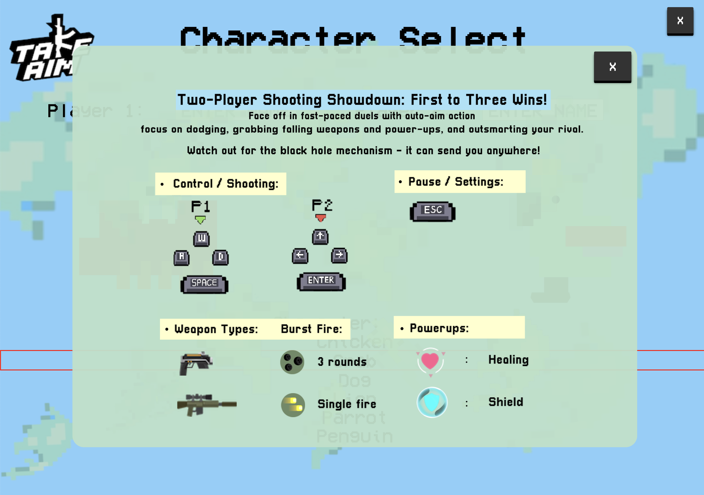
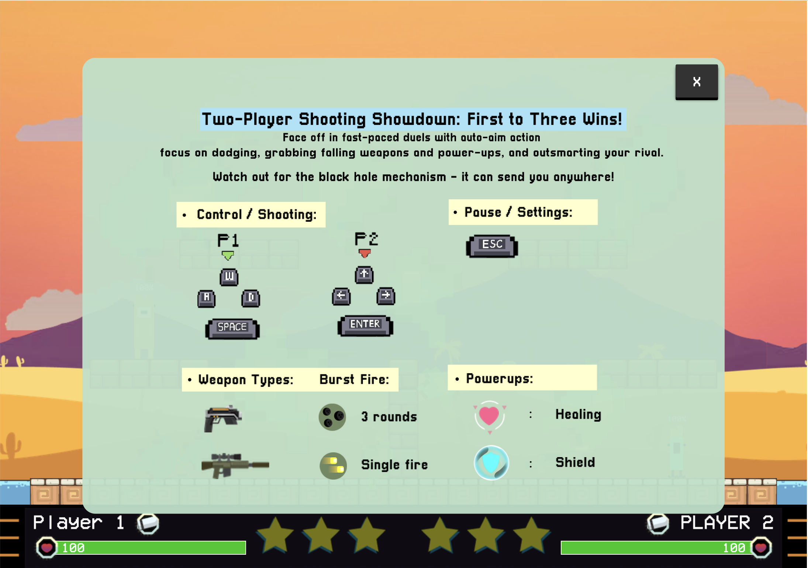
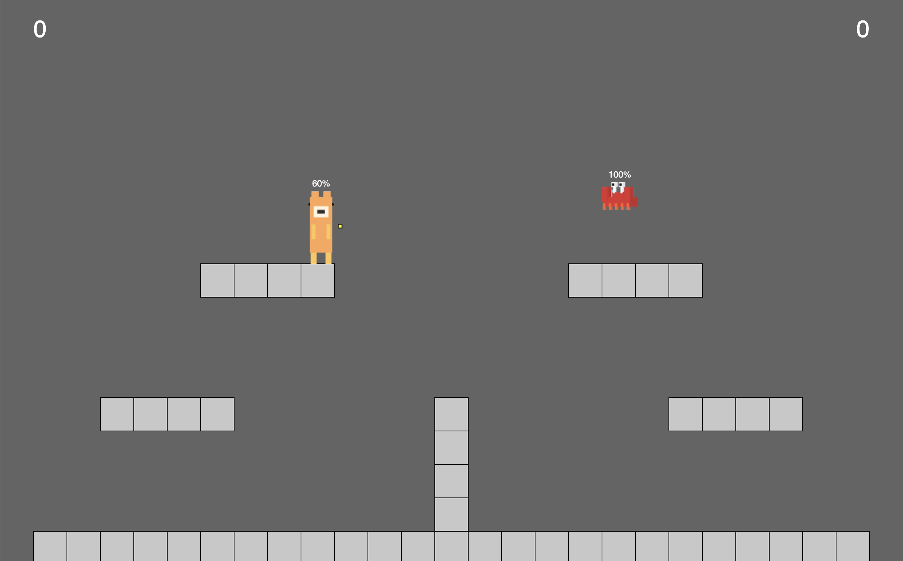
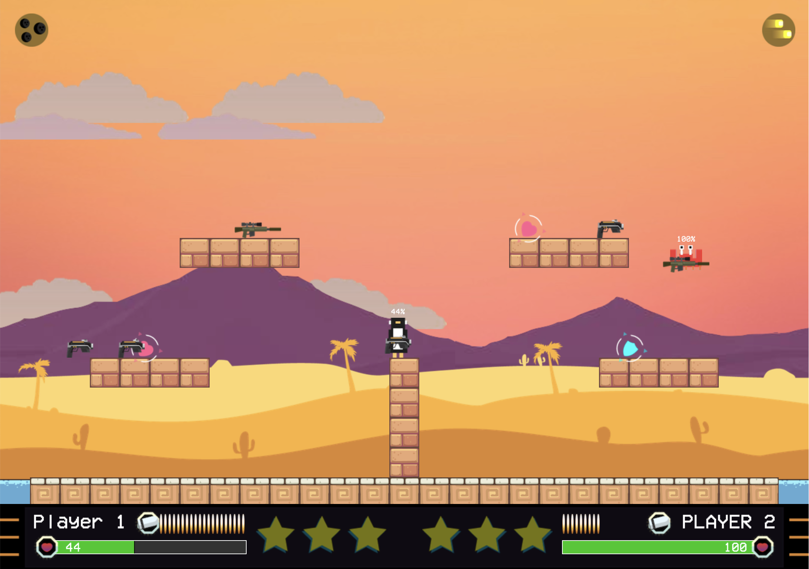

# TAKE AIM 
2025 COMSM0166 group 23  
[PLAY TAKE AIM HERE](https://uob-comsm0166.github.io/2025-group-23/index.html)

# Week 1: Game Selection Phase 1

During this week, our game selection process began. Our goal is to create a game that calls back to classic games in the past but brings another level of fun, freshness and challenges. Therefore, it was important for each member in the group to bring together 2 already existing games each, with their added twist to them. In our meeting, it was our responsibility to discuss potential development challenges we, as developers, could face during production. A summary of some of our game ideas are listed below with their brief description. 

| Game          | Description                                                                                                                                                                                                                                                                                                                                                                                                                                                                                                                                                                                            |
|---------------|--------------------------------------------------------------------------------------------------------------------------------------------------------------------------------------------------------------------------------------------------------------------------------------------------------------------------------------------------------------------------------------------------------------------------------------------------------------------------------------------------------------------------------------------------------------------------------------------------------|
| Tetris        | Tetris begins with an empty screen, and requires the player to fit falling blocks together.   **- Twist:** there will be two players competing against each other, player 1 will have the ability to change the shape of the blocks falling in player 2's screen, vice versa.   **- Development Challenges:** server creation; check matching and deletion of blocks.                                                                                                                                                                                                                            |
| Bounce        | The original bounce game is a platform game revolving around the player controlling a red ball and navigating through levels and obstacles..   **- Twist:** Imagine a new bounce game where the maps includes different terrain such as water, wind, and ice.   **- Development Challenge:** hard coding multiple maps of the game with different game objects and their properties.                                                                                                                                                                                                             |
| Flappy Bird   | The premise of Flappy Bird's endless runner game is simple: tap the screen to navigate a bird character object through the gaps between pipes without hitting them.   **- Twist:** the addition of different weather and terrain can add combinations of wind, rain, obstacles and power ups, affecting the birds movement.   **- Development Challenges:** developing different movement mechanics according to different weather types.                                                                                                                                                        |
| Snake Game    | In the game of Snake, the player usually use the arrow keys to move a "snake" around the board. As the snake finds food, it eats the food, and thereby grows larger. The game ends when the snake either moves off the screen or moves into itself.   **- Twist:** Imagine a board where every 30 seconds, sections of the floor fall and the snake has to traverse the map without falling.   **- Development Challenges:** random map generator for map generation; adding new parts of the snake at the tail.                                                                                 |
| Doodle Jump   | In the classic Doodle Jump game, player must guide a creature up an endless series of platforms without falling out of the screen.   **- Twist:** Imagine a doodle jump game where there is a color instruction that you must follow for the platform you must land next.   **- Development Challenge:** generating new platforms at random location at specific distance from each other at the top of the screen, at the same time being in-synced with the color instruction.                                                                                                                 |
| Cat vs Dog    | This game is an entertaining game in which these two characters, a cat and a dog, they will face each other in a battle throwing things at each other.   **- Twist:** characters randomly shrink every set amount of time, making it harder to target accurately.   **- Development Challenge:** programming the character being paused when it is hit; character shrinking mechanics.                                                                                                                                                                                                           |
| Temple Run    | In Temple Run, the player steers the explorer across a maze, avoiding obstacles while also collecting coins, the longer the explorer survives the higher the score.   **- Twist:** during gameplay the direction of the run go reverse mode.   **- Development Challenges:** 3D modelling of the map; storing data for game objects to allow reverse mode.                                                                                                                                                                                                                                       |
| Breakeout     | The classic Breakout Video Game uses a single ball where the player must knock own as many bricks as possible by using the walls and/or the paddle below to hit the ball against the bricks and eliminate them.   **- Twist:** add treasures within the blocks that once knock down, they can be used for power ups.   **- Development Challenge:** ball mechanics and collision handling for multiple balls.                                                                                                                                                                                    |
| Crossy Road   | Crossy Road has been one of the more recent fan favourite arcade hopper. The chicken collect custom characters to be used and navigate freeways, railroads, rivers while avoiding cars.   **- Twist:** Imagine, a crossy road game where you not only cross the road from one to the next but also move along into the direction of where the car is moving towards, pushing you to new environments.   **- Development Challenges:** frontend constraints for designing objects; programming a large amount of game object mechanics, generating adaptive environments for different obstacles. |
| Tower Defence | The goal of tower defence is to defend a player's territories or possessions by obstructing the enemy attackers or by stopping enemies from reaching the exit by placing defensive structures along their path of attack.   **- Twist:** Imagine each tower has no weapons of its own, but it granted unique abilities by adding gems to the tower, allowing to give it a different power depending upon which combination you use.   **- Development Challenge:** generating wave function for enemies and how they interact with different tower abilities.                                    | 

 

# Week 2: Paint Prototype and Setting Up Jira

### Paint Prototype
This week, we conducted a team excercise where we practiced the foundations of P5.js, a JavaScript library. This was both fun and vital as we will be using P5.js as our main language to create our game. Our goals was to create drawing app similar to Window's Paint.  
 
  
*Screenshot of Paint Prototype* 

[Link to the Paint App](https://peteinfo.github.io/COMSM0166-project-template/)

### Setting Up Jira 
As we are closing onto our game finalisation, we have set up a new project in Jira to be the center backlog of our sprint meeting. Here, all members of our team can easily share critical insights of our agile processes and highlight areas to improve on for our upcoming sprints. 

*Screenshots of Jira backlog and sprint 2* 

[Link to our Project Backlog](https://shabarish.atlassian.net/jira/software/projects/GD/boards/2?atlOrigin=eyJpIjoiYzI4ZmJlOTM5Nzg0NGQ3ZmEwZWUzZTU2MGM3YjcxNjUiLCJwIjoiaiJ9)

 

# Week 3: Game Selection Phase 2: Two Prototype Ideas
### **Take Aim**  
* Take Aim is a dynamic 1-2 player action game that emphasizes precise movement and strategic combat. Players compete to be the first to reduce their opponent’s Health to 0%, requiring quick reflexes and tactical decision-making. The game features character and map selection, allowing for varied playstyles and environments. At the start of each match, weapons drop from above within the first three seconds, setting the stage for intense battles. Players navigate the map using fluid movement—running, jumping (Up), and shooting (Space)—while avoiding hazards like moving walls. More mechanics and features were under discussion.

  [🎥 Watch the Video] https://github.com/user-attachments/assets/014afc4b-126e-4a76-b2ce-4081d37fe338

### **Tank Duel**  
* Tank Duel is a combat game where two players (or a player vs AI) take turns firing projectiles at each other. Each turn, the player controls a rotating aim that moves between a defined angle range (-X° to Y°) and a power bar that determines the shot’s strength. The objective is to reduce the opponent’s HP to zero by accurately hitting their tank with missiles.
Shots deal different amounts of damage based on where they land: 1)A critical Hit: A direct hit on the tank's head deals extra damage. 2)A normal Hit: A hit anywhere else does standard damage.
Players must carefully time their shot to optimize both angle and power for maximum effectiveness. The game can be played  against an AI opponent with varying difficulty levels and the first player to deplete the opponent's HP wins the match

  [🎥 Watch the Video] https://github.com/user-attachments/assets/fa8dd57c-4caf-4e66-9624-32d6d75544d8

## Your Game

[PLAY TAKE AIM HERE](https://uob-comsm0166.github.io/2025-group-23/index.html)

# Table of Contents
* [1. Development Team](#1-development-team)
* [2. Introduction](#2-introduction)
* [3. Requirements](#3-requirements)
* [4. Design](#4-design)
* [5. Implementation](#5-implementation)
* [6. Evaluation](#6-evaluation)
* [7. Process](#7-process)
* [8. Conclusion](#8-conclusion)
* [9. References](#9-references)

# 1. Development Team

.

  **Figure 1**  
  *Team Photo Week 1 and Team Roles*  

 

.

**Table 1**  
*Team member roles, from Left to Right in Figure 1* 

| MEMBER | NAME | EMAIL | ROLE | 
|--------|----------------|------------------------|------| 
|    1   | Ching-Yueh Lin     | xs24198@bristol.ac.uk | Frontend Developer |
|    2   | Yu-Hsin Chang      | mh24718@bristol.ac.uk | Frontend Developer |
|    3   | Gioven Posa        | kw24347@bristol.ac.uk | Backend Developer |
|    4   | Tzu-Wei Lee        | jj24506@bristol.ac.uk | Backend Developer |
|    5   | Kotzamanidis Nikos | yy24148@bristol.ac.uk | Product Owner |
|    6   | Shabarish Menon    | xh24681@bristol.ac.uk | Scrum Master |

## Project Report

# 2. Introduction

Welcome to the development documentation for **Take Aim**, an innovative 2D action shooter designed to reinvent platform arena-style combat with a blend of fast-paced gameplay and intelligent AI opponents. This documentation serves as a comprehensive guide through the entire development and design process of the game, serving as a resource for developers, evaluators, and game enthusiasts interested in the intricaies of modern game development, while highlighting key elements such as team roles, requirements and use cases, implementation challenges, evaluations testing, and sustainability considerations.

### About Take Aim
Based on contemporary gaming trends and bolstered by the felxibility of p5.js, **Take Aim** features both single-player and multiplayer modes with two difficulty settings - each affecting the behaviour and resilience of the computer-controlled adversary. The easy mode pits you against an AI that takes standard damage, while the hard mode introduces a tougher opponent which is designed to require even more precise timing and strategy. Key aspects that set **Take Aim** apart include: responsive and immersive UI, advanced AI mechanics, diverse and thematic game environments - like desert, underground, sky, - and innovative gameplay mechanics such as health tracking, power-ups and dynamic weapon-drops. 

### Development and Design
The project is driven by a collaborative team, with each member contributing unique skills across clear distribution of responsibilities ensuring an efficient workflow and robust software design. The documentation details the requirements that shaped **Take Aim**, specifically outlining key use cases which focus on different player interactions, ensuring that both single-player and multiplayer experiences are engaging and intuitive. Additionally, this documentation discusses some challenges we faced during the development process and how these challenges were addressed through iterative prototyping, rigorous testing, and performance evaluations. Detailed quantitvate and qualitative performance evaluations have been integral to the project, and such evaluations are documented to provide insight into how the game meets its design goals. Lastly, this document intends to share how our team recognisesd the importance of long-term maintainability and scalability - emphasising clean, modular code, comprehensive documentation, and a sustainable development process. 

# 3. Requirements 

### Ideation Process 

At the start of our ideation phase, we initially began with 12 different games. Our goal was to create a game that called back to classic games in the past but bringing another level of fun, freshness and challenges. Therefore, before finalising a game to develop, it was important for each member in the group to bring together 2 already existing games each, with their added twist to them. In our meeting, we discussed potential development challenges we, as developers, could face during production for each games that we liked. Some of the games we considered include Doodle Jump, Cat vs Dog, Bounce, and Flappy Bird. A summary of our game ideas with their brief description from Week1 are documented using *insert docs*. 

Moving into Week2, we have chosen two games to further expand on: Cat vs Dog, and Bounce. Communication between the team became more transparent as we decided to have three members working on each game, to go deeper on the specific in-game dynamics, mechanics, rules, and challenges. This was especially helpful to understand the scope of the entire development process. 

Week3 allowed us to showcase these ideas by creating Paper Prototypes of our initial game ideas. Unfortunately, from the feedback we have recieved from the testers, it was clear to us that both our ideas did not fully satisfy us in-terms of our shared goal of creating a game that is 'classic-throwback', fun, fresh and challenging. We decided to combine the features we loved from Cat vs Dog, and Bounce to create an entire new game concept. We took the face-to-face battle throwing concept of Cat vs Dog, combined with the manuevering of the classic platform game in Bounce, and we have a game that combines tactical game-play and strategic combat (insert Paper Prototype figure). 

### Early Stage Design 

As some members in our team have had previous game development experience before, we decided to create a playable prototype where we were able to perform initial user testing for collision checking, map tile initialisation and player key handling. This was extremely useful as it boosted the backend team's confidence in overcoming the initial developmental challenges we highlighted at the start (collision behaviours and map creation).

.

  **Figure #**  
  *Screenshot of Game Prototype During Early Development*  
  

For frontend design, our group shared a common interest in the style of "Crossy Road" for the character look and in-game theme. We love the idea of players being able to choose their characters, as well as varying maps and environments where the game is set similar to "Crossy Road", while manipulating the platform style genre similar to "Mario".

It was important to us that we are develop a game that incorporates varying playing styles and tactical game-play, so we experimented with the game mechanics such as developing different types of weapons, the interval between weapon drop, auto-aiming, black hole mechanics, and AI algorithm (for One Player Mode). 

### Importance of Our Key Stakeholders 

.

  **Figure #**  
  *Onion Model of Take Aim Game*  
   

1. **The Product or Service:** Take Aim Game
2. **Development Team:** Frontend, Backend, Quality Assurance, Product Owner, Scrum Master
3. **Game Testers:** Testers, Professors, Experts (assessors)
4. **Users:** "Retro Game/Arcade Game Lovers", Casual Gamers, Competitive Gamers, Interactive Gamers, Gamers with Disability

As we finalised our chosen game, it was clear to us that identifying and understanding key stakeholders is essential to ensuring a well-rounded, engaing, and accesible gaming experience. Our stakeholders include end-users, such as retro game entusiast, both casual and competitive gamers, interactive players, and gamers with disabilities. Each group bring unique expectations and preferences, guiding us with developing the mechanics that cater to various playstyles and accesibility needs.    
The development team, consisting of frontend and backend developers, quality assurance testers, a Product Owner, and a Scrum Master, is responsible for turning our ideas into a functional and immersive game. The team will also determine the technical feasibility, ensure performance optimisation, and maintain smooth development workflows. Additionally, game testers play a crucial role in validating our concepts, ensuring gameplay balance, and identifying potential issues before launch.    
By actively involving these stakeholders in our ideation process, we can create a game that not only meets industry standards but also resonates with our taget audience. This approcah allows us to refine our vision early on, reducing development risks and fostering a more innovative and player-centric experience. Committing to this stakeholder-driven approach ensures that Take Aim will be both technically sound and highly engaing for its intended audience.  
 

### Classifying Top-Level Needs with User Stories 

In order to have a better scope of what features we should prioritise, we gathered user-stories from our key stakeholders. These user stories were categorised by their Epics, a wider scope, high level requirement so that we can break our development process into independent, testable and valuable peices to implement.  

| Stakeholder | Epic | User Story | Acceptance Criteria | 
|-------------|-------------|----------|----------------|
| User: Retro/Arcade Lovers | Fullfill Player Enjoyment | "As a retro/arcade game lover, I want to play a classic game where I can customise the look of the players and display so that I can relive my favorite gaming experiences in a way that suits my preferences and enhances my enjoyment." | Given I am on the main menu, when I start game, then I should be able to change the player’s look to something like Pacman. |
| User: Casual Gamers | Implement Tutorial for Game Instructions + Pause Function | "As a casual gamer, I want the game instructions/rules to be very clear, and the visual design should be straight-forward. Also, I need to pause the game whenever I want." | Before the game starts, add a short interactive tutorial, then I can fully understand the game. Also, I should see a pause button function. |
| User: Competitive Gamers | Implement Multiplayer Mode | "As a gamer that is extremely competitive, I want to play against my friends so that I have bragging rights when I win” | "On the main menu page, when I navigate to the game mode page, then I should see an option for multiplayer game. | 
| User: Interactive Gamers | Implement Fast-paced in Game Activity | “As an interactive gamer, I want to be able to have different features, like weapons, available in-game so that the game feels different every time." | During the game I need new weapons to be spawned every few seconds and previous weapons to be discarded after a certain amount of time. |
| User: Gamers with Disability | Enhance Visual Accesibility | “As a user with low visibility, I want to be able to see my player and in game activity to be interactive”     “As a user with low visibility, I want to be able to resize the text of the main menu” | Given during gameplay, when a player is being hit, then I want to be able to clearly see this with bright and big colors or hear this action.     Given during the main menu page, when I navigate to the setting page, then I should see an option for resizing text. |
| Developers: Frontend | Improve UX in Game | "As a player, I want the graphical interface to be visually appealing and less straining on my eyes, so that I can play for longer periods without discomfort." | The UI should use less saturated colors to reduce eye strain.   Implement sound and visual effects for player actions (e.g., button clicks, attacks, game events).   Ensure that all game menus and interfaces are easy to navigate.   Transitions and animations should be smooth and visually engaging. |
| Developers: Backend | Improve UX in Game | "As a player, I want the game to respond smoothly to my actions so that I can enjoy a seamless gaming experience." | Optimize server response time to reduce lag and delays.   Ensure that real-time player actions (e.g., shooting, movement, interactions) are processed instantly.   Implement efficient database queries to speed up data retrieval and updates.   Expand game content by adding more map designs and increasing the variety of available weapons. |
| Developers: Quality Testers | Prototype Quality Assurance | "As a tester, I want to check the movement mechanics of the playable character so that the character moves as it is desired." | **Movement Controls:**   The character can move forward, backward, left, and right using the designated input controls (e.g., keyboard). The character's movement speed and responsiveness are consistent.     **Jump Mechanics:**   The character can jump to a specified height and distance.     **Collision Detection:**   The character does not pass through obstacles or walls.   Collision with objects is accurately detected, and appropriate reactions (e.g., stopping) are triggered.     **Environmental Interaction:**   The character can interact with the environment (e.g., climb on top of the platform) as specified.     **Performance:**   The character's movement does not cause any crashes or major bugs in the game. |
| Developers: Product owner | Ensure Game is Operating Smoothly | "As a product owner, I want to implement scalable and automated monitoring and logging solutions, so that I can ensure the system is consistently accessible and performing well for all users, including those with disabilities." | Given I am monitoring the system, when I observe the logs and alerts, then I should be able to quickly identify and resolve any accessibility or performance issues, ensuring the best experience for all users, including those with disabilities. |
| Developers: Scrum Master | Initiating Game Development Planning and Finalisation | "As a Scrum Master, I must decide the roles of each Team Member so that I can assign tasks accordingly." | **Role Clarification:**   Each team member understands their role and responsibilities.     **Task Assignment:**   Tasks are assigned to team members based on their roles and expertise. Each task has a clear description, due date, and expected outcome.     **Task Tracking:**   The progress of each task is regularly updated by the assigned team member.     **Communication:**   Regular communication is maintained among team members to discuss task progress and resolve any issues.     **Sprint Planning:**   Sprint planning meetings are conducted to review and assign tasks for each sprint.   The Scrum Master ensures that the team's workload is balanced and achievable within the sprint.     **Review and Feedback:**   Regular review meetings are conducted to assess task completion and gather feedback.   The team is encouraged to provide constructive feedback to improve future task assignments.     **Documentation:**   All assigned tasks, roles, and responsibilities are documented and accessible to the team.   Updates to roles and tasks are documented and communicated promptly. | 
| Game Testers | Ensure Feedback is More Categorized to Improve Game Design | "As a game trial player, I want to know what's the difference between this game and others, make it simple to understand and play with, so I can provide feedback on its enjoyment and playability." | Before the game, I need a prototype video to understand the whole game.   Also, after the game, provide me with a form of feedback categorized with usability, enjoyment and difficulty so you can clearly know how I feel about the game. | 
| Developers (Frontend and Backend) | Ensure Game Runs Smoothly on Various Devices and Browsers | "As a developer, I want the game to run efficiently in the browser without requiring high-end hardware, so that it is accessible and eco-friendly for users with different devices." | The game loads within 3 seconds on standard home internet and devices.   No more than 50MB of assets are loaded during gameplay to reduce memory usage.   Performance optimisations are applied to rendering and animation to keep gameplay at 60 FPS on mainstream browsers.   Idle state logic is implemented (e.g., pause menu, no background rendering) to reduce energy usage when game is not actively played. | 
| Gamers with Disabilities | Enhance Accessibility and Visual/Audio Feedback | "As a player with visual or hearing challenges, I want the game to clearly show and/or play sound when important events happen, so I can react in time." | When a player is hit, bright flashing colours and large text animations appear.   When weapons drop or a player is eliminated, clear sound effects are played.   The settings menu allows players to toggle or amplify visual/sound feedback.   Text and HUD elements are large and contrast-friendly for easy readability. | 
| Interactive Gamers & Solo Players | Provide Flexible Game Modes to Support All Player Types | "As a player, I want to choose between multiplayer and single-player modes so that I can enjoy the game whether I want to play socially or alone." | The main menu includes Single Player and Multiplayer game mode options.   Single Player mode offers AI opponents for casual or solo play.   Multiplayer mode allows players to compete locally or online.   The game tracks performance separately for both modes to encourage participation in either play style. |

### Use Cases Analysis
As our user stories includes a wider range of users such as both casual gamers and competitive players, it was vital for us to convert our user-stories into use case diagrams. This way, we can better conceptualise our development processes and mitigate the difficulties when making a game for a large group of costumers. By transforming our user stories into use case diagrams, we are able to visualise the interactions between the end-user, our development team and the game system itself, ensuring a well-organised and efficient development proccess.     
Each user story represent a real-world scenario that our end-user might experience when playing Take Aim. For example, a competitive gamer suggested that: "As a competitive gamer, I want to play against my friends so that I have bragging rights when I win."     
From this story, we extract key interactions and translate them into a use case diagram (shown below), where the competitive gamer (actor) interacts with the game system through use cases like "Start Game".     
By mapping these interactions, we have identitifed primary actors, clarify dependencies between different game functions, and ensure that all user needs are accounted for. This process also assisted our development team by providing a clear structure for implementing features in a user-focused manner.     
*Use Case Diagram 1: Main Menu Navigation*
    
*Use Case Diagram 2: Gameplay System*

### Use Case Specification and Documentation
*Screenshot of Use Case Documentation Introduction* 
    
*Screenshot of Use Case 2: Start Game (used as an example above)*
    
*Screenshot of Use Case Documentation Conclusion*
     

 
[📑 Link to the full Take Aim Use Case Documentiation] https://app.eraser.io/workspace/2WadpJ57Y5SRLlBTODcR?origin=share

 

# 4. Design

After reviewing our potential stakeholders and analysing a diverse range of User Stories, we now have a clear understanding of our objectives and requirements which means we identified the key features to integrate into our game design. The use of our Use-Case Documentation/Specification has made our development process much easier to structure, notably providing clear guides for developing the accessibility features and accommodated our fast-paced agile approach.  

We considered the following factors during the design process: 
- **Teck Stack:** As our game is a web-based game, we decided to use a JavaScript library called P5.js to build our Take Aim game. P5.js is a well known library for building creative animations therefore it is a perfect tool to develop a dynamic and fluid shooting game.
- **Data Storage & Collection:** As a team, we discussed if there was a need for our game to store essential data. To match the requirements, the players have the option to input a nickname to be displayed during the game. However, due to Take Aim being a web-based game, users wont need to install the game as the browser automatically downloads the necessary content from the game's website (GitHub Page). This means that users information will not be collected and game state's will not be saved.
- **System Architecture:** Before we began implementing code, it was important for us to touch on Take Aim system architecture design in order to visually represnt a blueprint for the game's system and components. So we created Class and Behavioural Diagrams to meet this. 

### Class Diagrams

A **Class Diagram** provided a systematic view of Take Aim as a System. This allowed us to structurally plan ahead the relationship between objects and help with visually identify where certain functions and variables should be located/implemented, which would contribute to good Object-Oriented Design (OOD) principles within our code. Each class has attributes and methods appropriate to their function within the game. For example, *GameController* directly communicates with *Player* and *AIPlayer* to control game progression, while *MapManager* provides the environment in which players interact. 

#### Game Mechanics
1. **Setup:** Initialises the whole game, loading neccessary resources like sprites, sounds, and setting up the game canvas.
2. **Game Controller:** Manages game states such as starting, pausing, and ending the game. It interacts with Player, AIPlayer, and manages game rounds.
3. **Player:** Represents both human and AI players, handling actions like moving, jumping, and shooting. Player is extended by AIPlayer.
4. **AIPlayer:** Inherits from Player, adding AI behaviours such as finding weapons, hiding, and pathfinding to power-ups and weapons.
5. **Items:** Manages in-game huds like health icons, weapons icons. It is responsible for displaying and updating these items.
6. **Power-Ups:** Handles power-ups within the game, including their effects and updates during the game.
7. **Sound Manager:** Manages all sound effects and music, controlling their playback based on game events.
8. **Sprite Manager:** Loads and manages all sprites used in the game, providing sprites based on player index and direction.
9. **Map Manager:** Manages the game maps, including their creation, rendering, and animation based on predefined tiles and background imges.

.

  **Figure #**  
  *Class Diagram Generated Week 10*  
   

 

### Behavioural Diagrams

Following the Class Diagram, we wanted to effectively visualise the behaviour of Take Aim as a whole program so we formed a **Sequence Diagram**. This offered a clear visual representation of how various game components interacted over time, which we found was a powerful tool for both our team's planning and communication. By mapping out player actions, AI logic, and system responses, our team were able to quickly identify design flaws which improved collaboration. 

In order to meet the requirement specification, we ensured to develop a system architecture that starts with a user-interface menu. Take Aim begins with the *Setup* component initiating the game mode setup via the *Game Controller*, which further initialises the maps, generates the player(s), weapons, and power-ups through respective components such as *Map Manager*, *Player*, *Weapon*, and *Power-Ups*. 

The core gameplay loop involves continuous player updates (movements and interactions), weapon pickups, bullet generation and usage, player damage handling, and power-up consumption. An AI player is also generated in single-player mode, and continuously updates its movement behaviour depending on the player and game states. *Sprite Manager* serves images upon request, supporting visual elements of the game.

.

  **Figure #**  
  *Sequence Diagram of Take Aim*  
   

 

### Agile Methodology

We incorporated agile methods when designing Take Aim which required fequent updates to our system architecture. So by having an updated class and sequence diagrams to show during sprints cycles, our developers, testers, designers, and stakeholders maintained a unified understanding of the system, a key Agile value. 

However, due to rapid iteration cycles, some diagrams quickly became outdated which required extra workload to update and hindered our teams agility efficiency on a few occasions. One way we overcame this issue is by creating multiple different github branches of our game repository that handles the implementation of predefined features, as well as a *currentWorkingBranch* where we implemented final versions of features into one working program.

Overall, agile's iterative nature required constant testing, debugging, and refactoring. Our behavioural diagrams simplified these processes by quickly identifying where interactions broke down or misalign with expected behaviour, improving responsiveness to change. 

# 5. Implementation

After reviewing our development process, we have encountered a number of interesting and pivotal challenges. The challenges focuses around: the game UI/UX design demands, the auto-aim feature, and the data structure algorithm for AI (hard-mode) pathfinder. Including other minor prerequisite implementations that took multiple iterations and rigorous testing to complete, such as the map-collision handler and player controls.

Prior to implementing any of the challenges, it was a prerequisite to create two basic platformers representing: **Player 1** and **Player 2**. Although not one of our main developmental challenges, we found that programming the players movement was initially difficult. For example, our initial approach to applying gravity to the player's ability to jump would cause both of the platformers to move infinitly upwards and outside the canvas. To overcome this, we realised that each players will need two sets of different keys, so passing the respected key buttons (shoot, left, right, and jump) in the parameters is the best way to instantiate the players and their respected controls. Next, in order for these platformers to have an environment they can interfact with, we created a 2D array of tiles with a predefined size and populated the canvas with it. Initially, we expected to include the map collision check as one of our main challenges however, this turned out to be a quick implementation due to previous project experience in this concept. Our approach used the predefined *width* and *height* of the tiles with conditional checks such as **isOnPlatform** method.

### Challenges
**1. Auto-Aim Feature**

One of the most technically nuanced features we developed was the auto-aim shooting mechanic, implemented inside the *Player.shoot()* method. The purpose of this mechanic was to simplify player input by automatically targeting the opponent whenever the shoot key is pressed, simulating a form of assisted targeting. Although this may sound straightforward in theory, implementing this functionality presented several unexpected challenges. 

.

  **Figure #**  
  *Auto-Aim GIF of Two-Player Mode*  
   

Our initial difficulty stemmed from determining the most accurate and fair way to calculate the direction a bullet should travel. We knew the shooting player would need to "auto-aim" towards the opponent, but due to dynamic positions, gravity, jumping states, and horizontal movement, achieving consistent targeting without unfair advantage was tricky. Early iterations would cause bullets to fire in unnatural directions - especially when players were close together or overlapping vertically - resulting in missed shots or self-inflicted misfires. 

To resolve this, we implememented a solution that calculates the center of both the shooting player and the target player using x/y positions and sprite dimensions. We then used the *atan2()* function to determine the exact angle between them, which was used to rotate the weapon sprite and to calculate the bullet velocity vector using basic trigonometry *(dx / distance, dy / distance)*. Normalising the direction vector by dividing by the computed distance ensured bullets always traveled consistently at the desired speed regardless of the distance between players. 

**2. AI Pathfinder(Hard Mode)**

A particularly complex implementation during our development was designing the AI player's pathfinding system, especially in hard mode. This challenge involved creating a non-trivial decision-making process for navigating a dynamic platformer map while selecting weapons, avoiding bullets, and positioning for tactical attacks. In contrast to this, the first iteration of AI player involved a hard coded reactive behaviour that allows the AI to behave in a pre-defined way based on the other player which we felt could be the easy version of the game.

The central issue was building a robust AI that understands the environment and reacts to both static platforms and dynamic game elements like power-ups and bullets. Our early versions of this AI would either get stuck in infinite loops when navigating vertically or behave unrealistically - either walking off edges or trying to jump at walls. Since the game is a 2D platformer, vertical navigation added additional complexity. 

To tackle this, we created a graph-based node system representing the top of platforms in *NodeNetwork.js* (as shown in Figure #). Nodes are connected horizontally and vertically (with safety checks to prevent excessive vertical chaining, using a max chain constrait in A*). This map graph is initialised each round using *buildPlatformNetwork()*, allowing the AI to perform *A\* pathfinding* based on valid movement constrainst. 

.

  **Figure #**  
  *AI Pathfinder Nodes*  
   

We extended the *AIPlayer* class from the base *Player* class and gave it states like *seekingWeapon*, *shooting*, and *seekingPowerUp*. Each AI update checks for nearby bullets (to dodge), finds the nearest desirable item (weapon or power-up), and navigates to it using a custom A* implementation that avoids paths with excessive vertical climbs. 

One of the hardest bugs we fixed was the AI getting stuck vertically. It turned out that nodes were being linked without accounting for unreachable vertical chains. We added a "vertical chain constraint" that limited consecutive vertical transitions to five, which stabilised movement logic dramatically. 

#### Key enhancement incuded: 
- Prioritised shortest paths with the fewest jumps.
- Bullet detection with dodging behaviour and cooldown.
- Fallback strategies if pathfinding failed or AI was blocked. 

The result is a challenging reactive AI that feels organic to play against - especially when combined with its decision to engage players only when it has a clear line of sight or access to power-ups. 

**3. Game Graphic Design**

Perhaps the most time-consuming and visually demanding part of the development for the frontend team was creating the 3D character models and integrating them into fully interactive Character Selection Page. The goal was to have a seamless and polished selection experience where players could preview rotating 3D versions of character like *Lion, Parrot, Dog, Crab, Penguin* and *Chicken* - each built entirely using p5.js's WEBGL system.

One of the most persistent challenges was ensuring that each character was accurately constructed and visually distinct while still maintaining a consistent design language. Each model required dozens of individual 3D primitives (box, speheres, etc) layers and transformed in 3D space. We had to iterate through several poses, proportions, and rotations to make sure characters looked engaging from all angles. 

An additional layer of complexity came from having to convert standalone sketches (each character was developed separately for testing) into a unified, working UI component within the *CharacterPage*. Managing canvas rendering, viewports, and interactively in a multi-character, multi-player selection interface pushed the limits of p5.js's DOM integration. 

.

  **Figure #**  
  *Crab and Pengiun p5.js Sketches*  
   
   

We modularised each character sketch into its own function (eg. *parrotSketch, lionSketch*, etc.) and registered them inside a preview map structure. This allowed the *CharacterPage.js* to dynamically generate and attach p5.js instances to designated HTML containers based on player input. We also used *p.ortho()* and transparent backgrounds to make sure each 3D canvas blended with the UI. 

To ensure consistency and usability: 
- All characters were scaled appropriately and centered in the canvas.
- Angle rotation (*rotateY*) was implemented per frame for a smooth preview.
- Each player preview was isolated to prevent DOM collisions.
- UI elements were styled with a consistent pixel font and layout to match the game's retro tone.

Although initially frustrating, the final result offered a professional, responsive character selection experience - essential to setting the tone before the gameplay begins. 

# 6. Evaluation

This week, we invited other team members to try out the newly released version of our game. We received a lot of positive feedback, along with some valuable suggestions and ideas. To collect comprehensive insights, we conducted several evaluation methods, including **Think Aloud Evaluation, Heuristic Evaluation, NASA-TLX for workload assessment, and the System Usability Scale (SUS)**.

**1. Think Aloud Evaluation:**

Participants were encouraged to think aloud as they played, expressing their thoughts and reactions in real-time. We recorded their feedback, paying special attention to moments of confusion and engagement. From these observations, we identified several key themes and categorized the feedback as follows:

| Category            | Issue                                                                                                                                  | Solution                                                                                                                                                       |
|---------------------|----------------------------------------------------------------------------------------------------------------------------------------|----------------------------------------------------------------------------------------------------------------------------------------------------------------|
| **Player Control**  | 1. It's difficult to distinguish player identity when selecting the same character. 2. Health visibility is unclear during gameplay. | 1. Display the player's name above their character. 2. Add a health percentage indicator both above the character and at the bottom of the game panel.     |
| **Game Instructions** | The game lacks an instruction page, making it difficult for players to understand controls, weapons, black hole mechanics, etc.        | - Implement an instruction page accessible by pressing "Esc". - Preload the instructions during loading and require players to read them.                  |
| **Difficulty**       | The AI opponents feel overly challenging for some players.                                                                             | Introduce difficulty settings. Players can choose a preferred difficulty level (Easy, Hard) before starting the game.                                          |

This feedback gave us a clearer understanding of where players encountered friction or confusion. Based on this, we’ve already started implementing targeted improvements to enhance both usability and gameplay experience.

**2. Heuristic Evaluation:**

To ensure our game delivered a smooth and engaging player experience, we conducted a heuristic evaluation based on Nielsen’s usability principles. We invited seven observers and experts to assess the main game interface, whose insights helped us identify key usability issues, such as unclear health displays and confusing controls. This process guided our team to implement targeted improvements, significantly enhancing gameplay and player satisfaction. 

<table style="width: 100%;">
  <tr>
    <th style="width: 10%;">Interface</th>
    <th style="width: 50%;">Issue</th>
    <th style="width: 20%;">Heuristic(s)</th>
    <th style="width: 5%;">Frequency (0-4)</th>
    <th style="width: 5%;">Impact (0-4)</th>
    <th style="width: 5%;">Persistence (0-4)</th>
    <th style="width: 5%;">Severity (F+I+P/3)</th>
  </tr>
  <tr>
    <td>Main Game</td>
    <td>Unclear keyboard controls for character operation</td>
    <td>Help and documentation</td>
    <td>3</td>
    <td>4</td>
    <td>0</td>
    <td>2.3</td>
  </tr>
  <tr>
    <td>Main Game</td>
    <td>Player health display is unclear or hard to see</td>
    <td>Visibility of system status</td>
    <td>4</td>
    <td>3</td>
    <td>4</td>
    <td>3.6</td>
  </tr>
  <tr>
    <td>Main Game</td>
    <td>Different weapons deal the same damage, confusing players</td>
    <td>Match between system and the real world</td>
    <td>3</td>
    <td>2</td>
    <td>2</td>
    <td>2.3</td>
  </tr>
  <tr>
    <td>Main Game</td>
    <td>Too many powerups make the game too easy</td>
    <td>Match between system and the real world</td>
    <td>2</td>
    <td>1</td>
    <td>2</td>
    <td>1.6</td>
  </tr>
</table>

The heuristic evaluation of the game highlights some usability issues with different levels of impact. 

- **Unclear** health display (Severity 3.6): Players can’t clearly see their remaining health, a frequent issue that disrupts gameplay and persists, violating the "Visibility of system status" heuristic.
- **Unclear** keyboard controls (Severity 2.3): Unclear controls for character operation frustrate players often, tied to the "Help and documentation" heuristic.
- **Confusing** weapon damage (Severity 2.3): Different weapons dealing the same damage confuses players frequently, linked to the "Match between system and the real world" heuristic.
- **Excessive** powerups (Severity 1.6): Too many powerups make the game too easy, a less common but persistent issue, also tied to "Match between system and the real world" heuristic.

Fixing the health display and adding better instructions should be top priorities to level up the player experience and gameplay.  
 
### Improvements Implemented 
To enhance the game’s usability, we made the following improvements:  
- **Fixed the unclear health display**: Added a clear health bar at the bottom of the game screen with high-contrast colours, making it easy for players to track their status. 
- **Clarified keyboard controls**: Introduced a clear instruction page, shown during the pre-game loading screen, ensuring players knew how to operate characters without confusion. 
- **Resolved weapon confusion**: Differentiated weapon damage and added varied weapon types to meet player expectations and eliminate confusion. 
- **Balanced powerups**: Reduced powerup frequency to keep the game challenging and engaging.

  <strong>Figure #</strong>  
  Implemented instruction page in both pre-loading and in-game
  <table>
    <tr>
      <td></td>
      <td></td>
    </tr>
  </table>

  <strong>Figure #</strong>  
  Improved health bar display before and after
  <table>
    <tr>
      <td></td>
      <td></td>
  </tr>
  </table>

   
By prioritizing the health bar and control instructions, we’ve significantly improved the player experience and gameplay flow.

- 15% ~750 words

- One qualitative evaluation (your choice) 

- One quantitative evaluation (of your choice) 

- Description of how code was tested. 

# 7. Process 

- 15% ~750 words

- Teamwork. How did you work together, what tools did you use. Did you have team roles? Reflection on how you worked together.

# 8. Sustainability, Ethics and Accessibility 

Sustainability is now central to software engineering and game development. Following the framework introduced in our sustainability lectures, sustainability can be understood across several dimensions, including environmental, social, technical, individual, and economic aspects. Throughout the design and implementation of Take Aim, our team actively embedded sustainability concerns, particularly focusing on environmental, social, and technical dimensions to ensure ethical and accessible gameplay experiences.

<strong>Environmental Sustainability</strong>

Although video games are less resource-intensive than other ICT products, they still contribute to global energy usage, particularly through hosting infrastructure, network transmission, and client-side processing. In response, Take Aim was deliberately designed as a lightweight web-based game using P5.js. This decision enabled the delivery of rich gameplay experiences through minimal resource consumption on the client side. By optimising rendering processes and avoiding heavy graphical or computational demands, we reduced the energy footprint on end-user devices.

Furthermore, our deployment strategy reflects careful consideration of sustainability. Hosting the game via GitHub Pages leverages existing infrastructure, eliminating the need for bespoke server solutions that would otherwise increase electricity and cooling demands. This aligns with the principles of substitution and optimisation highlighted in sustainability design — replacing resource-heavy approaches with lightweight alternatives and optimising system operation to minimise energy use.

<strong>Social and Ethical Sustainability</strong>

Social sustainability emphasises inclusiveness, diversity, and ethical responsibilities towards users. In Take Aim, we implemented several features to address these areas. Firstly, we prioritised visual accessibility. Recognising that gamers may have varying levels of visual acuity, we incorporated bright colour schemes, animated feedback for damage and actions, and clear health and score displays. These improvements enable players with visual impairments or colour perception differences to fully engage with the game, addressing ethical obligations to inclusiveness and usability.

Secondly, the game design supports different social needs and preferences. Multiplayer mode fosters social interaction and competition, while single-player AI mode ensures that individuals who may prefer or require solitary play can still enjoy a complete experience. This flexibility supports individual well-being and addresses inclusiveness and diversity aspects.

Additionally, ethics played a key role in gameplay design. Unlike many mainstream games that rely on monetisation strategies that can exploit players, Take Aim does not include advertisements, in-game purchases, or addictive reward loops. This ethical design choice promotes healthier gameplay patterns and ensures that the game respects users' time and attention.

<strong>Technical Sustainability</strong>

Technical sustainability focuses on software maintainability, usability, and long-term viability. Throughout development, we adopted modular design principles and best practices to ensure Take Aim remains adaptable and easy to maintain. Frontend components, such as the character selection screen, health HUD, and game menus, were developed as reusable and independent modules. This approach aligns with good object-oriented design and simplifies future updates, bug fixes, and feature expansion.

Furthermore, by leveraging P5.js — a widely-supported and actively maintained open-source library — we avoided proprietary technologies that may become obsolete. This reduces risks of "software rot" and supports the long-term accessibility of Take Aim for future players and developers.

Finally, development processes also reflected technical sustainability values. Features were incrementally developed and tested, avoiding technical debt and ensuring clean, efficient codebases. These practices support not only maintainability but also contribute to reduced resource consumption during ongoing development and deployment phases.

<strong>Conclusion</strong>

Take Aim demonstrates that integrating sustainability into game development is achievable and essential. Through lightweight deployment and optimisation for energy efficiency, the game reduces its environmental footprint. By prioritising accessibility, ethical design, and social inclusiveness, the game offers positive social impacts and ethical responsibility. Finally, through modular architecture and maintainable code, it supports technical sustainability for future growth and adaptability.

In conclusion, our project reflects the understanding that software developers have a responsibility to shape technology in ways that promote not only enjoyment and engagement, but also long-term sustainability, ethical practice, and accessibility.

# 9. Conclusion

- 10% ~500 words

- Reflect on project as a whole. Lessons learned. Reflect on challenges. Future work.

# 10. References  

### Contribution Statement

- Provide a table of everyone's contribution, which may be used to weight individual grades. We expect that the contribution will be split evenly across team-members in most cases. Let us know as soon as possible if there are any issues with teamwork as soon as they are apparent. 

### Additional Marks

You can delete this section in your own repo, it's just here for information. in addition to the marks above, we will be marking you on the following two points:

- **Quality** of report writing, presentation, use of figures and visual material (5%) 
  - Please write in a clear concise manner suitable for an interested layperson. Write as if this repo was publicly available.

- **Documentation** of code (5%)

  - Is your repo clearly organised? 
  - Is code well commented throughout?
